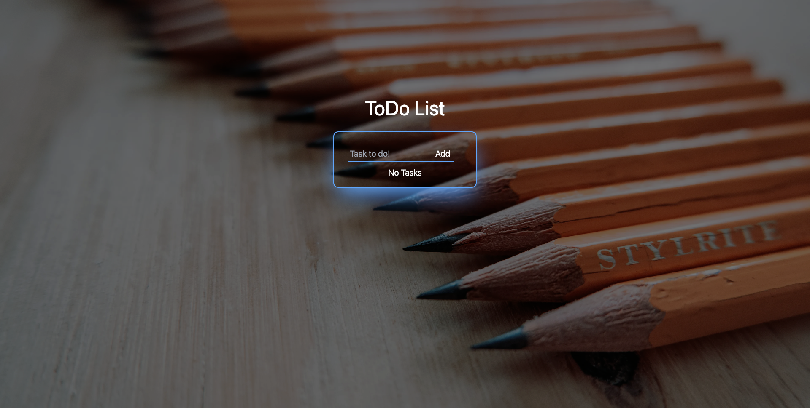

# TechCation

## Deployed Website
[ToDo](todo-drab-seven-41.vercel.app)  
Initial Deployment Date: April 12, 2023

## Description
I have built a simple todo app that will allow you to keep track of your daily task and mark them complete when finished. If you need to update your task you can do so. You can also delete your task when done. It is saved to the database under users id. This app is also made into an PWA using workbox-webpack-plugin. So feel free to download it to the computer or phone. 

## Tech Used
- NextJS
- Tailwind
- MongoDB
- workbox-webpack-plugin

## Prototype

## Questions
Feel free to contact any contributing developer with suggestions for improvements, questions or concerns.
 
[Email: Aaron Anglin](mailto:aaron.anglin101@gmail.com)

## Contributor
<td align="center"><a href="https://github.com/aanglin"> <b>Aaron Anglin</b></a></td>